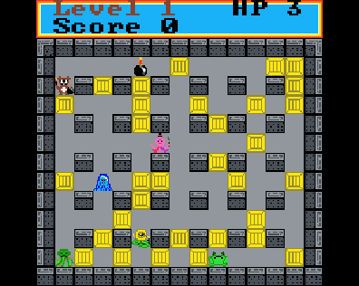
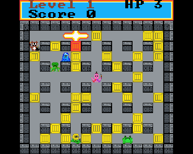

# Bomberman

## 🤔 What is this game about?
This game is about a bear planting a bombs to explode crates and find a portal to teleport him.
It's based on the DOS game Dyna Blaster from 1990.

## ❓ Rules
- Fire and monsters kills you
- Plant bombs to kill monsters and explode crates
- Find a portal and enter him after all enemies are gone

## 🎮 Controls
- `W` / `S` / `A` / `D` - move player
- `K` - plant a bomb
- `L` - restart level

## 🖼 Screenshots

## 🕹 Sprig Snapshot
You can play game in current state here: [https://sprig.hackclub.com/share/QNsIABoF4l6gJeyc2soj](https://sprig.hackclub.com/share/QNsIABoF4l6gJeyc2soj)

## 📝 TODO
Game is still in progress, but first level is playable so you can experience it.

Nice to have features, I'll be working on:
- [x] Add more levels
- [x] Add more powerups
- [ ] Exploding portal should spawn enemies
- [ ] Improve movement of stronger monster
- [x] ~Add level loading screen~
- [x] Count score
- [x] Add death sprites for monsters
